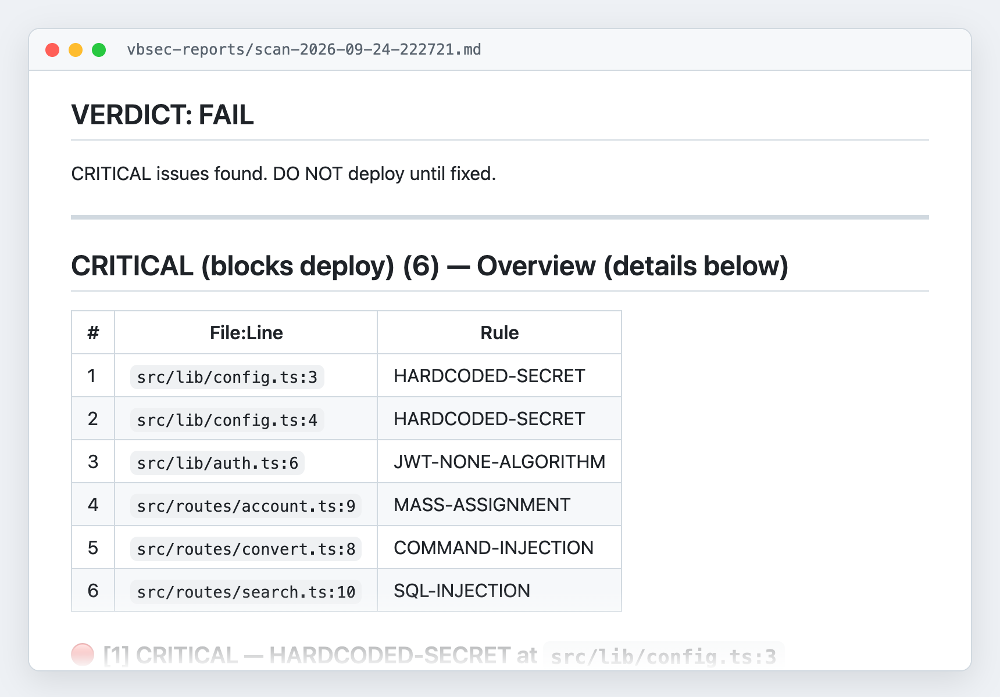
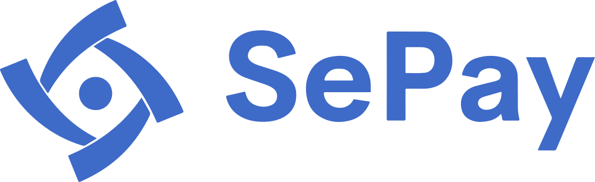
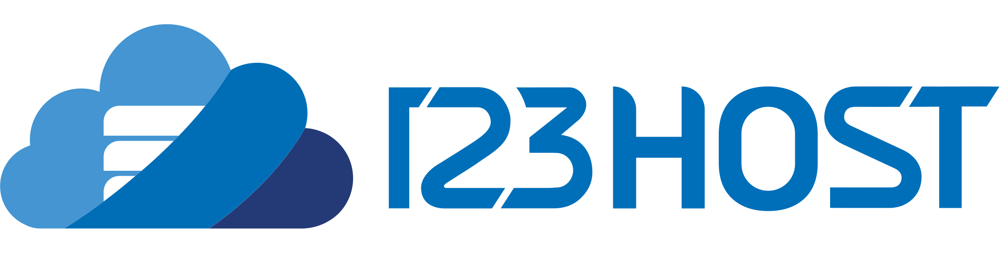

<h1 align="center">vbsec — Security scanning for AI-written code</h1>

<p align="center">A security scanning skill for Claude Code, Codex and Antigravity: it reads your code, finds the 21 most common vulnerability types, and shows you how to fix each one.<br>Free · Open source · Nothing extra to install</p>

<p align="center">
  <a href="./LICENSE"></a>
  <a href="https://github.com/tanviet12/vbsec/stargazers"></a>
  
  
  
</p>

<p align="center">
  <b><a href="#install">Install</a></b> ·
  <b><a href="docs/examples/sample-report.md">Sample report</a></b> ·
  <b><a href="#what-vbsec-catches">21 vulnerability types</a></b> ·
  <b><a href="README.vi.md">Tiếng Việt</a></b>
</p>

<p align="center">
  <a href="docs/examples/sample-report.md"></a><br>
  <sub>A real report from scanning a sample Express + React app. Click the image to read the full report.</sub>
</p>

## What vbsec does

- **Finds vulnerabilities in AI-written code**: passwords in source, SQL injection, broken access control, JWTs accepted without signature checks, wide-open CORS and more: 21 of the most common types
- **Explains them for people who aren't security experts**: every issue says why it's dangerous, how an attacker would exploit it step by step, the current code, and the fixed code
- **Understands code instead of matching strings**: it traces data from user input to the dangerous call, so it raises far fewer false alarms than pattern-based scanners
- **Goes deep on 5 languages**: Go, PHP, TypeScript/JavaScript, Python, .NET/C#, including popular frameworks such as Express, NestJS, Next.js, React, Django, FastAPI, Laravel and ASP.NET Core
- **Scans exactly what you need**: the whole repo, uncommitted changes only, one commit, one pull request, or the last N days of commits
- **Works without git**: drop AI-generated code into a folder and scan it right away
- **Stays fast on big repos**: splits the work across several agents running in parallel, then merges the results
- **Reports in English or Vietnamese**, saved as a file in `vbsec-reports/` you can hand to whoever fixes it, with a JSON summary at the end for CI/CD

## Example: what vbsec catches

The code below works. Clicking through the app by hand, you'd never notice a problem. AI assistants write code like this all the time.

```typescript
// src/lib/auth.ts
const payload = jwt.decode(token);      // decodes only, does NOT verify the signature
(req as any).user = payload;

// src/routes/search.ts
const rows = await sequelize.query(
  `SELECT id, name, price FROM products WHERE name LIKE '%${q}%'`   // q comes from the URL
);
```

vbsec reports 2 **CRITICAL** issues:

| Issue | Impact | Fix vbsec suggests |
|---|---|---|
| `JWT-NONE-ALGORITHM` | Anyone can mint their own `role: "admin"` token without the secret key | Use `jwt.verify(token, secret, { algorithms: ["HS256"] })` |
| `SQL-INJECTION` | Typing `' UNION SELECT email, password_hash...` into the search box dumps the whole user table | Pass parameters with `` replacements: { q: `%${q}%` } `` instead of building the string |

Read the [full sample report](docs/examples/sample-report.md) to see how vbsec explains each issue.

## Test results

The repo ships 8 sample apps with known, planted bugs (Go, PHP, TypeScript, Python, .NET), including hard cases: data flowing through several files, sanitizers written wrong, race conditions when deducting a balance. Each set also has traps that look like bugs but are safe, to measure false alarms.

| | Latest run |
|---|---|
| Bugs caught | **54/55** |
| False alarms on safe traps | **0** |

AI output can vary between runs. Re-run it yourself with `./scripts/run-fixtures.sh` (see [`tests/README.md`](tests/README.md)). vbsec has also been tried on OWASP Juice Shop and caught the vulnerability classes matching its documented challenges.

## How vbsec works

**It reads code like a reviewer, not like grep.** Many scanners flag every `query(` as "possible SQL injection", so they cry wolf constantly and people stop reading. vbsec reads the surrounding code, works out where the data comes from, and only then decides.

Take the same line of code:

```typescript
db.query(`SELECT * FROM products WHERE name = '${x}'`)
```

- If `x` comes from a search box the user types into (`req.query.q`): **flagged**, because anyone can type malicious SQL there.
- If `x` is a constant in the code or a value from a config file: **not flagged**, because outsiders can't change it.

To tell these apart, vbsec sorts data into 4 trust levels, from "sent by a stranger" (forms, URLs, headers, uploads) to "produced by the system" (constants, environment variables). Only stranger-supplied data that reaches a dangerous call without being cleaned gets reported.

**It knows each language and framework.** On top of the general rules, vbsec has dedicated rules for Go, PHP, TypeScript/JavaScript, Python and .NET, so it knows each library's traps. For example: `Prisma.sql` is safe but `$queryRawUnsafe` is not, `bypassSecurityTrustHtml` in Angular switches off XSS protection, and Gin's debug mode left on in production.

**Small repos scan instantly, big ones get split up.** Under about 20 code files, vbsec scans directly in roughly 30–60 seconds. Larger repos are split into parts for up to 3 agents working in parallel, then the results are merged and de-duplicated.

**One issue per line item.** A line of code with 2 problems (say, reading another user's data and a race condition) shows up as 2 separate issues. Counts stay honest, and each one can be ticked off as it's fixed.

**Reports in English or Vietnamese.** Vietnamese is the default; add `lang=en` for English. The report ends with a fixed-format JSON block in English, so CI/CD can read it and block merges while critical issues remain.

**The same rules on all three tools.** Claude Code, Codex and Antigravity share one rule set and produce the same findings. The only difference: Claude Code runs in parallel, so it's faster on large repos.

## Install

You need one of: [Claude Code](https://docs.claude.com/claude-code), [OpenAI Codex CLI](https://developers.openai.com/codex), [Google Antigravity](https://antigravity.google).

```bash
git clone https://github.com/tanviet12/vbsec ~/vbsec
~/vbsec/scripts/install.sh
```

The script detects which of these tools you have and installs the skill for each. To update later: `cd ~/vbsec && git pull`.

Manual install, installing for one specific tool, troubleshooting: [docs/en/installation.md](docs/en/installation.md).

## Usage

| Tool | How to run |
|---|---|
| Claude Code | `/vbs-scan-security` |
| OpenAI Codex CLI | `$vbs-scan-security` |
| Google Antigravity | say "scan security for this repo" |

```bash
/vbs-scan-security lang=en                       # scan the whole folder (default), English report
/vbs-scan-security uncommitted lang=en           # uncommitted changes only; worth running before every commit
/vbs-scan-security pr id 42 lang=en              # scan pull request #42
/vbs-scan-security commit within 7days lang=en   # commits from the last 7 days
```

Reports are saved to `vbsec-reports/scan-<timestamp>.md` inside the scanned folder. Add `vbsec-reports/` to `.gitignore`; vbsec reminds you if it's missing.

All options: [docs/en/usage.md](docs/en/usage.md).

## What vbsec catches

| Category | Issues |
|---|---|
| Leaked secrets, config | `HARDCODED-SECRET` · `VERBOSE-ERROR-DEBUG-MODE` · `CORS-MISCONFIG` |
| Injection | `SQL-INJECTION` · `COMMAND-INJECTION` · `XSS` · `INSECURE-DESERIALIZATION` · `SSRF` · `PATH-TRAVERSAL` |
| Authentication, authorization | `BROKEN-ACCESS-CONTROL` · `IDOR` · `MASS-ASSIGNMENT` · `JWT-NONE-ALGORITHM` · `WEAK-PASSWORD-HASHING` · `CSRF` |
| Abuse protection | `BRUTE-FORCE` · `MISSING-RATE-LIMIT` · `RACE-CONDITION` · `UNRESTRICTED-FILE-UPLOAD` |
| Dependencies | `OUTDATED-DEPENDENCY` · `SLOPSQUATTING` (package names the AI made up, registered first by attackers) |

Severity, vulnerable and safe code examples, and which languages have dedicated rules: [docs/en/rules.md](docs/en/rules.md).

## Limitations

vbsec is a first line of defense, not proof that your system is secure.

- It does not replace a security review by professionals
- It does not guarantee catching 100% of vulnerabilities
- It does not query CVE databases online. Check dependencies for known vulnerabilities with `npm audit`, `pip-audit`, `govulncheck`, `composer audit`

## Add a badge to your repo

Scanned with vbsec and fixed everything? Add this badge to your README:

[](https://github.com/tanviet12/vbsec)

```markdown
[](https://github.com/tanviet12/vbsec)
```

## Sponsors

vbsec is free and open source thanks to:

<table>
  <tr>
    <td align="center" valign="top" width="50%">
      <a href="https://sepay.vn?utm_source=github&utm_medium=readme&utm_campaign=vbsec"></a><br>
      <b><a href="https://sepay.vn?utm_source=github&utm_medium=readme&utm_campaign=vbsec">SePay</a></b><br>
      Open Banking platform: automatic bank transfer confirmation and API connections to Vietnamese banks
    </td>
    <td align="center" valign="top" width="50%">
      <a href="https://123host.vn?utm_source=github&utm_medium=readme&utm_campaign=vbsec"></a><br>
      <b><a href="https://123host.vn?utm_source=github&utm_medium=readme&utm_campaign=vbsec">123HOST</a></b><br>
      Hosting, VPS, servers and domains for businesses and developers in Vietnam
    </td>
  </tr>
</table>

## Authors

- **[Bui Tan Viet](https://www.facebook.com/buitanviet)** — CEO, [SePay](https://sepay.vn) and [123HOST](https://123host.vn)
- **Phan Quoc Hien** — CTO, [SePay](https://sepay.vn) and [123HOST](https://123host.vn)

vbsec distills security experience from running real payment and hosting systems, which get attacked every day, into a rule set that lets AI review the code AI writes.

Other open-source projects:

- **[Sano](https://github.com/tanviet12/sano-sach-noi)** — turn Word documents into audiobooks with AI; Vietnamese voices that run on your own machine
- **[Chat Quality Agent](https://github.com/tanviet12/chat-quality-agent)** — AI scoring of customer-support quality on Zalo OA and Facebook Messenger

## Contributing

Contributions are welcome: bug reports, rule fixes, new languages. See [docs/en/contributing.md](docs/en/contributing.md).

### Three platforms, one rule set

| Platform | Skill folder | Large repos |
|---|---|---|
| Claude Code | `skills/vbs-scan-security/` (canonical) | 3 parallel agents |
| OpenAI Codex CLI | `skills/codex/vbs-scan-security/` | Scans parts one by one |
| Google Antigravity | `skills/antigravity/vbs-scan-security/` | Scans parts one by one |

Edit rules in the canonical `skills/vbs-scan-security/`, then run `./scripts/sync-skills.sh` to copy them to the other two. `SKILL.md` and `workflows/large-review*.md` are maintained separately per platform.

### Before opening a PR

```bash
./scripts/sync-skills.sh               # sync the 3 skill variants
./scripts/run-fixtures.sh typescript   # scan the sample app and score it (costs tokens; run the language you changed)
```

### Roadmap

- Done: general rules; dedicated rules for Go, PHP, TypeScript/JavaScript, Python, .NET/C#; three platforms; scanning without git
- In progress: online CVE lookup via OSV.dev (`--sca`), automatic fixes verified by building (`--auto-fix`)
- Next: Ruby, Java, Rust, driven by community demand

## License

[MIT](./LICENSE) · © 2026 Bui Tan Viet & Phan Quoc Hien
