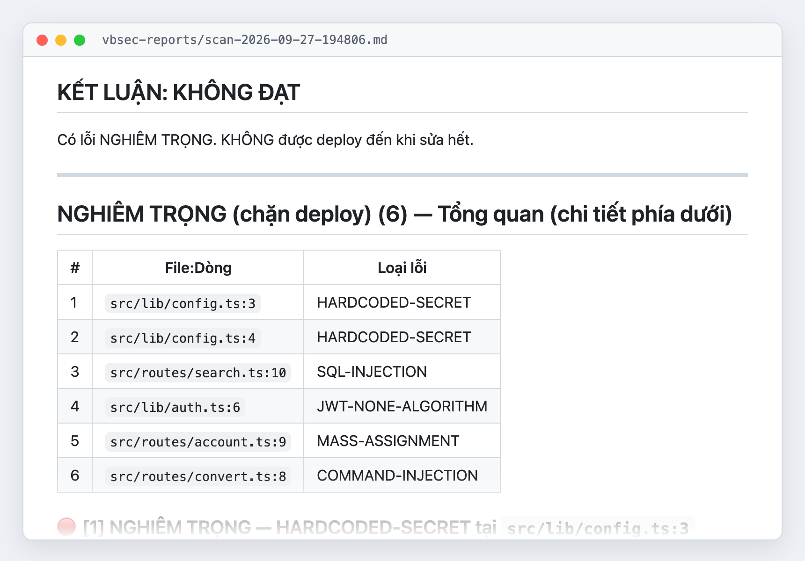

<h1 align="center">vbsec — Quét bảo mật cho code do AI viết</h1>

<p align="center">Skill quét bảo mật cho Claude Code, Codex và Antigravity: đọc code của bạn, tìm 21 loại lỗ hổng hay gặp nhất và chỉ cách sửa từng lỗi.<br>Miễn phí · Mã nguồn mở · Không cài thêm phần mềm</p>

<p align="center">
  <a href="./LICENSE"></a>
  <a href="https://github.com/tanviet12/vbsec/stargazers"></a>
  
  
  
</p>

<p align="center">
  <b><a href="#cài-đặt">Cài đặt</a></b> ·
  <b><a href="docs/examples/bao-cao-mau.md">Xem báo cáo mẫu</a></b> ·
  <b><a href="#vbsec-bắt-được-những-lỗi-nào">21 loại lỗi</a></b> ·
  <b><a href="README.md">English</a></b>
</p>

<p align="center">
  <a href="docs/examples/bao-cao-mau.md"></a><br>
  <sub>Báo cáo thật khi quét một app Express + React mẫu. Bấm vào ảnh để đọc bản đầy đủ.</sub>
</p>

## vbsec làm được gì

- **Tìm lỗ hổng trong code AI viết**: lộ mật khẩu trong code, SQL injection, phân quyền sai, JWT không kiểm chữ ký, CORS mở toang... tổng cộng 21 loại lỗi hay gặp nhất
- **Giải thích cho người không chuyên bảo mật**: mỗi lỗi có phần vì sao nguy hiểm, hacker khai thác thế nào từng bước, code hiện tại và code sửa lại
- **Đọc hiểu code, không dò chữ máy móc**: lần theo dữ liệu từ input người dùng tới chỗ nguy hiểm, nên ít báo nhầm hơn công cụ dò mẫu chuỗi
- **Chuyên sâu 5 ngôn ngữ**: Go, PHP, TypeScript/JavaScript, Python, .NET/C#, hiểu framework phổ biến như Express, NestJS, Next.js, React, Django, FastAPI, Laravel, ASP.NET Core
- **Quét đúng phần cần quét**: cả repo, chỉ phần chưa commit, một commit, một pull request, hoặc các commit trong N ngày
- **Chạy được cả khi chưa có git**: bỏ code AI sinh vào một thư mục rồi quét luôn
- **Repo lớn vẫn nhanh**: tự chia cho nhiều agent quét song song rồi gộp kết quả
- **Báo cáo tiếng Việt hoặc tiếng Anh**, lưu thành file trong `vbsec-reports/` để gửi cho người sửa, cuối file có JSON cho CI/CD đọc

## Ví dụ: vbsec bắt được gì

Đoạn code dưới đây chạy đúng chức năng, test tay không thấy lỗi gì. AI viết ra loại code này rất thường xuyên.

```typescript
// src/lib/auth.ts
const payload = jwt.decode(token);      // chỉ giải mã, KHÔNG kiểm chữ ký
(req as any).user = payload;

// src/routes/search.ts
const rows = await sequelize.query(
  `SELECT id, name, price FROM products WHERE name LIKE '%${q}%'`   // q lấy từ URL
);
```

vbsec báo 2 lỗi **NGHIÊM TRỌNG**:

| Lỗi | Hậu quả | Cách sửa vbsec đưa ra |
|---|---|---|
| `JWT-NONE-ALGORITHM` | Ai cũng tự tạo được token `role: "admin"` mà không cần khoá bí mật | Dùng `jwt.verify(token, secret, { algorithms: ["HS256"] })` |
| `SQL-INJECTION` | Gõ `' UNION SELECT email, password_hash...` vào ô tìm kiếm là lấy được cả bảng user | Dùng tham số `replacements: { q: \`%${q}%\` }` thay vì nối chuỗi |

Đọc [báo cáo mẫu đầy đủ](docs/examples/bao-cao-mau.md) để xem cách vbsec giải thích từng lỗi.

## Kết quả thử nghiệm

Repo có sẵn 8 bộ code mẫu cài lỗi biết trước (Go, PHP, TypeScript, Python, .NET, gồm cả câu khó: dữ liệu đi qua nhiều file, hàm làm sạch viết sai, race condition khi trừ số dư). Mỗi bộ có thêm bẫy trông giống lỗi nhưng an toàn, để đo báo nhầm.

| | Kết quả lần chạy gần nhất |
|---|---|
| Bắt được | **54/55** lỗi cài sẵn |
| Báo nhầm bẫy an toàn | **0** |

Kết quả của AI có thể khác nhau giữa các lần chạy. Tự chạy lại bằng `./scripts/run-fixtures.sh` (xem [`tests/README.md`](tests/README.md)). vbsec cũng đã được thử trên OWASP Juice Shop và bắt được các nhóm lỗi tương ứng với challenge của Juice Shop.

## Cách vbsec hoạt động

**Đọc code như người review, không dò chữ.** Nhiều công cụ quét cứ thấy chữ `query(` là báo "có thể bị SQL injection", nên báo nhầm rất nhiều, đọc một lúc là chán. vbsec thì đọc đoạn code đó, xem dữ liệu đưa vào lấy từ đâu, rồi mới kết luận.

Ví dụ với cùng một câu lệnh:

```typescript
db.query(`SELECT * FROM products WHERE name = '${x}'`)
```

- Nếu `x` lấy từ ô tìm kiếm người dùng gõ vào (`req.query.q`): **báo lỗi**, vì ai cũng gõ được câu SQL độc vào đó.
- Nếu `x` là hằng số trong code hoặc giá trị trong file cấu hình: **không báo**, vì người ngoài không đổi được.

Để phân biệt, vbsec chia dữ liệu thành 4 mức, từ "người lạ gửi lên" (form, URL, header, file upload) tới "hệ thống tự tạo" (hằng số, biến môi trường). Chỉ dữ liệu từ người lạ, đi tới chỗ nguy hiểm mà chưa được lọc, mới bị báo.

**Hiểu từng ngôn ngữ và framework.** Ngoài bộ luật chung, vbsec có luật riêng cho Go, PHP, TypeScript/JavaScript, Python và .NET. Nhờ vậy nó biết những cái bẫy riêng của từng thư viện. Ví dụ `Prisma.sql` là an toàn nhưng `$queryRawUnsafe` thì không, `bypassSecurityTrustHtml` trong Angular tắt luôn lớp chống XSS, Gin quên tắt debug mode khi chạy thật.

**Repo nhỏ quét ngay, repo lớn chia việc.** Dưới khoảng 20 file code, vbsec quét trực tiếp, mất chừng 30–60 giây. Repo lớn hơn thì chia thành nhiều phần cho tối đa 3 agent quét song song, xong gộp kết quả lại và bỏ lỗi trùng.

**Mỗi lỗi một dòng riêng.** Một dòng code dính 2 lỗi (vd vừa xem được dữ liệu người khác, vừa bị race condition) sẽ hiện thành 2 lỗi riêng. Đếm số lỗi không bị sai, và từng lỗi sửa xong đánh dấu được.

**Báo cáo tiếng Việt hoặc tiếng Anh.** Mặc định tiếng Việt, thêm `lang=en` để ra tiếng Anh. Cuối báo cáo có một đoạn JSON cố định bằng tiếng Anh, để hệ thống CI/CD đọc và chặn merge khi còn lỗi nghiêm trọng.

**Cùng một bộ luật trên cả ba công cụ.** Claude Code, Codex và Antigravity dùng chung bộ luật nên cho ra cùng kết quả. Khác biệt duy nhất: Claude Code chạy song song nên nhanh hơn với repo lớn.

## Cài đặt

Cần một trong ba: [Claude Code](https://docs.claude.com/claude-code), [OpenAI Codex CLI](https://developers.openai.com/codex), [Google Antigravity](https://antigravity.google).

```bash
git clone https://github.com/tanviet12/vbsec ~/vbsec
~/vbsec/scripts/install.sh
```

Script tự nhận ra máy đang có công cụ nào và cài skill cho công cụ đó. Cập nhật bản mới: `cd ~/vbsec && git pull`.

Cài thủ công, cài cho một công cụ cụ thể, xử lý sự cố: [docs/vi/installation.md](docs/vi/installation.md).

## Sử dụng

| Công cụ | Cách gọi |
|---|---|
| Claude Code | `/vbs-scan-security` |
| OpenAI Codex CLI | `$vbs-scan-security` |
| Google Antigravity | nói "scan security cho repo này" |

```bash
/vbs-scan-security                       # quét cả thư mục (mặc định)
/vbs-scan-security uncommitted           # chỉ phần chưa commit, nên chạy trước mỗi lần commit
/vbs-scan-security pr id 42              # quét pull request số 42
/vbs-scan-security commit within 7days   # các commit trong 7 ngày gần nhất
/vbs-scan-security lang=en               # báo cáo tiếng Anh
```

Báo cáo lưu ở `vbsec-reports/scan-<thời gian>.md` trong thư mục được quét. Nên thêm `vbsec-reports/` vào `.gitignore`, vbsec sẽ nhắc nếu chưa có.

Mọi tuỳ chọn: [docs/vi/usage.md](docs/vi/usage.md).

## vbsec bắt được những lỗi nào

| Nhóm | Lỗi |
|---|---|
| Lộ bí mật, cấu hình | `HARDCODED-SECRET` · `VERBOSE-ERROR-DEBUG-MODE` · `CORS-MISCONFIG` |
| Chèn lệnh | `SQL-INJECTION` · `COMMAND-INJECTION` · `XSS` · `INSECURE-DESERIALIZATION` · `SSRF` · `PATH-TRAVERSAL` |
| Đăng nhập, phân quyền | `BROKEN-ACCESS-CONTROL` · `IDOR` · `MASS-ASSIGNMENT` · `JWT-NONE-ALGORITHM` · `WEAK-PASSWORD-HASHING` · `CSRF` |
| Chống lạm dụng | `BRUTE-FORCE` · `MISSING-RATE-LIMIT` · `RACE-CONDITION` · `UNRESTRICTED-FILE-UPLOAD` |
| Thư viện | `OUTDATED-DEPENDENCY` · `SLOPSQUATTING` (package AI bịa tên, hacker đăng ký trước) |

Mức độ, ví dụ code lỗi và code an toàn, ngôn ngữ nào có luật chuyên sâu: [docs/vi/rules.md](docs/vi/rules.md).

## Giới hạn

vbsec là lớp phòng thủ đầu tiên, không phải bằng chứng hệ thống an toàn.

- Không thay thế đợt kiểm tra bảo mật do chuyên gia làm
- Không đảm bảo bắt được 100% lỗ hổng
- Không tra cơ sở dữ liệu CVE trực tuyến. Kiểm tra thư viện có lỗ hổng bằng `npm audit`, `pip-audit`, `govulncheck`, `composer audit`

## Gắn badge cho repo của bạn

Đã quét bằng vbsec và sửa hết lỗi? Gắn badge này vào README:

[](https://github.com/tanviet12/vbsec)

```markdown
[](https://github.com/tanviet12/vbsec)
```

## Đơn vị tài trợ

vbsec miễn phí và mã nguồn mở nhờ sự tài trợ của:

<table>
  <tr>
    <td align="center" width="50%">
      <a href="https://sepay.vn?utm_source=github&utm_medium=readme&utm_campaign=vbsec"></a><br>
      <b><a href="https://sepay.vn?utm_source=github&utm_medium=readme&utm_campaign=vbsec">SePay</a></b><br>
      Nền tảng Open Banking: tự động xác nhận thanh toán chuyển khoản, kết nối API với các ngân hàng Việt Nam
    </td>
    <td align="center" width="50%">
      <a href="https://123host.vn?utm_source=github&utm_medium=readme&utm_campaign=vbsec"></a><br>
      <b><a href="https://123host.vn?utm_source=github&utm_medium=readme&utm_campaign=vbsec">123HOST</a></b><br>
      Hosting, VPS, máy chủ và tên miền cho doanh nghiệp, nhà phát triển Việt Nam
    </td>
  </tr>
</table>

## Tác giả

- **[Bùi Tấn Việt](https://www.facebook.com/buitanviet)** — CEO [SePay](https://sepay.vn) và [123HOST](https://123host.vn)
- **Phan Quốc Hiên** — CTO [SePay](https://sepay.vn) và [123HOST](https://123host.vn)

vbsec gom kinh nghiệm bảo mật khi vận hành hệ thống thanh toán và hosting thật, nơi bị tấn công hằng ngày, thành một bộ luật để AI tự rà code do chính AI viết.

Dự án mã nguồn mở khác:

- **[Sano](https://github.com/tanviet12/sano-sach-noi)** — tạo sách nói bằng AI từ file Word, giọng đọc tiếng Việt chạy ngay trên máy
- **[Chat Quality Agent](https://github.com/tanviet12/chat-quality-agent)** — dùng AI chấm chất lượng chăm sóc khách hàng qua Zalo OA, Facebook Messenger

## Dành cho người đóng góp

Mọi đóng góp đều được chào đón: báo lỗi, sửa luật, thêm ngôn ngữ mới. Đọc [docs/vi/contributing.md](docs/vi/contributing.md).

### Ba nền tảng, một bộ luật

| Nền tảng | Thư mục skill | Repo lớn |
|---|---|---|
| Claude Code | `skills/vbs-scan-security/` (bản gốc) | 3 agent song song |
| OpenAI Codex CLI | `skills/codex/vbs-scan-security/` | Quét lần lượt từng phần |
| Google Antigravity | `skills/antigravity/vbs-scan-security/` | Quét lần lượt từng phần |

Sửa luật ở bản gốc `skills/vbs-scan-security/`, rồi chạy `./scripts/sync-skills.sh` để chép sang hai bản còn lại. `SKILL.md` và `workflows/large-review*.md` viết riêng cho từng nền tảng.

### Kiểm tra trước khi gửi PR

```bash
./scripts/sync-skills.sh               # đồng bộ 3 bản skill
./scripts/run-fixtures.sh typescript   # quét bộ mẫu và chấm điểm (tốn token, chạy ngôn ngữ mình sửa)
```

### Lộ trình

- Đã có: luật chung, chuyên sâu Go, PHP, TypeScript/JavaScript, Python, .NET/C#; ba nền tảng; quét không cần git
- Đang làm: tra CVE trực tuyến qua OSV.dev (`--sca`), tự sửa lỗi và kiểm build (`--auto-fix`)
- Tiếp theo: Ruby, Java, Rust theo nhu cầu cộng đồng

## Giấy phép

[MIT](./LICENSE) · © 2026 Bùi Tấn Việt & Phan Quốc Hiên
